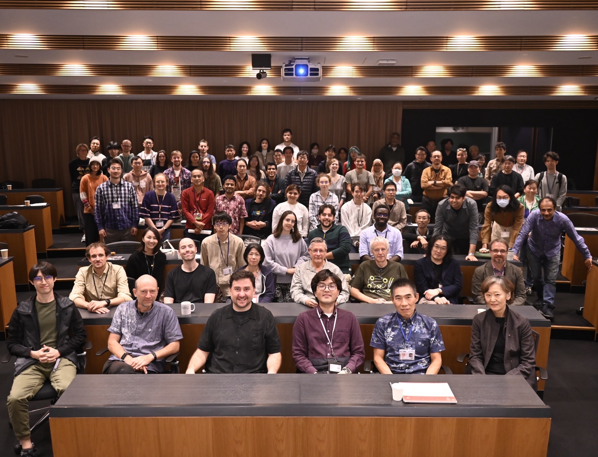
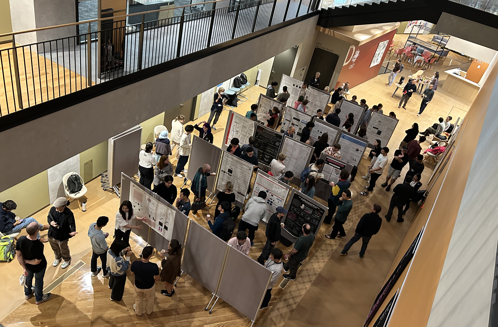
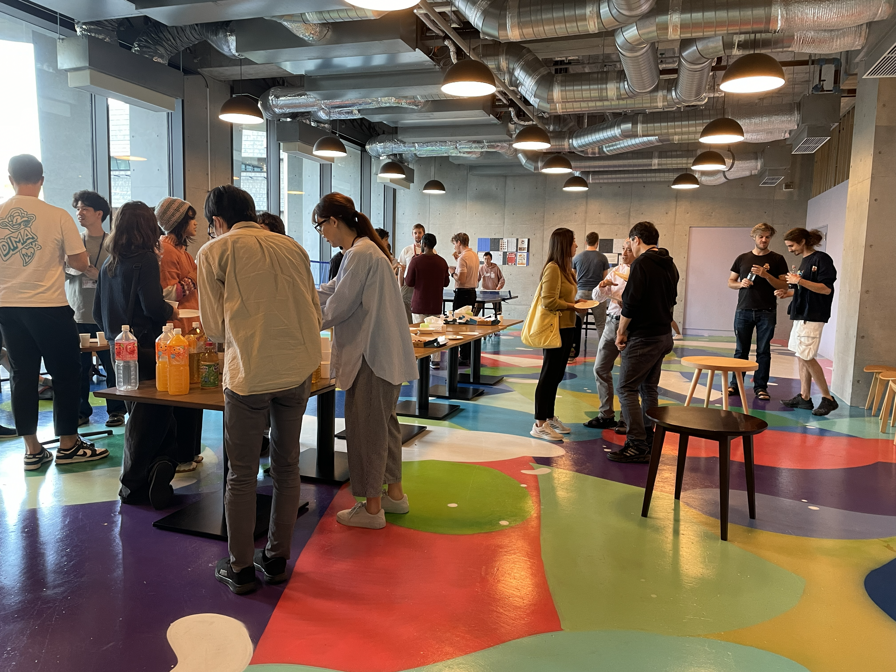

<section class="hero">
<div class="hero-inner">

<div class="hero-main">
<p class="hero-title">
<span>OIST</span>
<span>NEUROSCIENCE</span>
<span class="symposium-title">SYMPOSIUM '26</span>
</p>

<p class="hero-tagline">A space to share, connect, and discover</p>

<p class="hero-description">
A student- and researcher-led initiative to build bridges between the diverse OIST neuroscience community.
</p>

<div class="hero-actions">
<a class="register-button" href="#registration">
REGISTER NOW
</a>
<a class="secondary-button" href="#about">LEARN MORE ↓</a>
</div>
</div>

<div class="hero-event">
<p class="event-label">SAVE THE DATE</p>

<p class="event-date">
<span>DEC</span>
<span>7–8</span>
<span>2026</span>
</p>

<p class="event-place">
OIST<br>
Okinawa, Japan
</p>
</div>

</div>
</section>


<section id="about" class="glance-section">
<div class="glance-inner">

<p class="section-eyebrow">THE FIRST ONS EDITION</p>

<h2>ONS 2025 AT A GLANCE</h2>

<p class="glance-intro">
People from every career stage and area of neuroscience were brought together to share and hear about the work happening across OIST.
</p>

<div class="stats-grid">

<div class="stat-card stat-blue">
<span class="stat-number">100+</span>
<span class="stat-label">PARTICIPANTS</span>
</div>

<div class="stat-card stat-purple">
<span class="stat-number">17</span>
<span class="stat-label">TALKS</span>
</div>

<div class="stat-card stat-yellow">
<span class="stat-number">35</span>
<span class="stat-label">POSTERS</span>
</div>

<div class="stat-card stat-red">
<span class="stat-number">19+</span>
<span class="stat-label">LABS REPRESENTED</span>
</div>

</div>

<p class="glance-text">

</p>

```{=html}
<div class="photo-grid">



</div>
```

<div class="themes-section">

<p class="breakdown-title">2025 RESEARCH THEMES</p>

<div class="floating-themes">

<span class="theme theme-1">cognition</span>
<span class="theme theme-2">imaging</span>
<span class="theme theme-3">learning</span>
<span class="theme theme-4">theory</span>
<span class="theme theme-5">circuits</span>
<span class="theme theme-6">memory</span>
<span class="theme theme-7">behavior</span>
<span class="theme theme-8">computation</span>
<span class="theme theme-9">synapses</span>
<span class="theme theme-10">new technologies</span>

</div>

</div>

<div class="participant-breakdown">

<p class="breakdown-title">2025 PARTICIPANTS</p>

<div class="percentage-grid">

<div class="percentage-item percent-blue">
<span class="percentage-number">29.2%</span>
<span class="percentage-label">PHD<br>STUDENT</span>
</div>

<div class="percentage-item percent-purple">
<span class="percentage-number">19.8%</span>
<span class="percentage-label">POSTDOCTORAL<br>SCHOLAR</span>
</div>

<div class="percentage-item percent-yellow">
<span class="percentage-number">13.2%</span>
<span class="percentage-label">STAFF<br>SCIENTIST</span>
</div>

<div class="percentage-item percent-red">
<span class="percentage-number">12.3%</span>
<span class="percentage-label">TECHNICIAN</span>
</div>

<div class="percentage-item percent-green">
<span class="percentage-number">8.5%</span>
<span class="percentage-label">FACULTY<br>PI</span>
</div>

<div class="percentage-item percent-pink">
<span class="percentage-number">5.7%</span>
<span class="percentage-label">RESEARCH<br>FELLOW</span>
</div>

<div class="percentage-item percent-teal">
<span class="percentage-number">4.7%</span>
<span class="percentage-label">RESEARCH<br>INTERN</span>
</div>

<div class="percentage-item percent-gray">
<span class="percentage-number">6.6%</span>
<span class="percentage-label">OTHER</span>
</div>

</div>

</div>

</div>
</section>

<!-- =========================================
     JOIN US — ONS 2026
     ========================================= -->

<section class="join-section">
<div class="join-inner">

<div class="join-content">

<p class="join-eyebrow">DECEMBER 7–8 · OIST</p>

<h2>JOIN US AT <br><span class="join-title-event">ONS 2026</span></h2>

<p class="join-intro">
Two days to share your science, discover research happening across OIST,
and connect with the neuroscience community.
</p>

<div class="join-activities">

<div class="join-activity">
<span class="activity-number">01</span>
<span class="activity-name">KEYNOTE TALKS</span>
</div>

<div class="join-activity">
<span class="activity-number">02</span>
<span class="activity-name">SHORT TALKS</span>
</div>

<div class="join-activity">
<span class="activity-number">03</span>
<span class="activity-name">POSTER SESSIONS</span>
</div>

<div class="join-activity">
<span class="activity-number">04</span>
<span class="activity-name">SOCIAL EVENTS</span>
</div>

<div class="join-activity">
<span class="activity-number">+</span>
<span class="activity-name">AND MORE</span>
</div>

</div>


</div>

<div id="registration" class="join-register">

<p class="join-question">
GOT A PROJECT TO SHOWCASE?<br>
A TECHNIQUE TO SHARE?<br>
OR JUST NEURO-CURIOUS?
</p>

<p class="join-date">
<span>DEC</span>
<span>7–8</span>
<span>2026</span>
</p>

<p class="registration-label">
REGISTER HERE:
</p>

<div class="registration-options">

<a class="registration-option" href="https://forms.cloud.microsoft/r/kkqKdnYvbL" target="_blank">
<span class="registration-type">OIST PARTICIPANTS</span>
<span class="registration-arrow">→</span>
</a>

<a class="registration-option" href="https://forms.cloud.microsoft/r/bbPqJeKp4z" target="_blank">
<span class="registration-type">RYUDAI PARTICIPANTS</span>
<span class="registration-arrow">→</span>
</a>

<a class="registration-option" href="https://forms.cloud.microsoft/r/ZQ5mjBU1aR" target="_blank">
<span class="registration-type">RIKEN AND KEIO PARTICIPANTS</span>
<span class="registration-arrow">→</span>
</a>

</div>

<p class="registration-deadline">
<strong>REGISTRATION DEADLINE:</strong> <strike>(OCTOBER 2)</strike> &#8594; OCTOBER 10<br>
Applies to all participant groups.
</p>

</div>

</div>

<footer class="site-footer">
<div class="footer-inner">

<div class="footer-organizer">
<span>Organized by</span>
<strong>ONC</strong>
</div>

<div class="footer-contact">
<span>CONTACT US</span>
<a href="mailto:oistneuroscienceclub@365groups.oist.jp">
oistneuroscienceclub@365groups.oist.jp
</a>
</div>

</div>
</footer>

</section>
